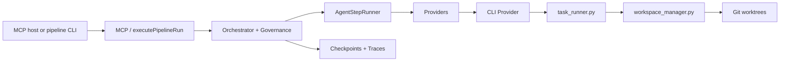

# llm-pipeline

[](LICENSE)

**Multi-step code-change pipelines for coding agents** — git worktree isolation, provider races, local traces. Exposed as an **MCP server** and a small **CLI** (`pipeline run`).

**Version:** 3.0.0

## Why llm-pipeline?

Not another chat-loop framework. See **[`docs/differentiation.md`](docs/differentiation.md)** (vs LangGraph, CrewAI, **AutoGen**, OpenHands).

| Differentiator | What it means |
|----------------|---------------|
| **Repo-native** | `agent-write` in git worktrees + cross-process locks (`workspace_manager.py`) |
| **Config-first DAG** | `pipeline.config.json` — implement → review → retry, optional parallel/race |
| **Host-agnostic** | MCP from Cursor, Claude Desktop, Claude Code, …; backends = Codex / Gemini / OpenCode / … |
| **Local observability** | Traces + A/B `experiments.jsonl` — no LangSmith required |
| **Production-shaped** | Guardrails, approvals, checkpoints, optional reflect re-plan |

```
  IDE / CLI host (MCP)          llm-pipeline              coding-agent CLI
  ───────────────────►   DAG + governance + trace   ──►   Codex / Gemini / …
                                    │
                                    ▼
                            git worktree (target repo)
```

## Quick start (zero API keys)

```bash
git clone <repo-url> llm-pipeline && cd llm-pipeline
npm install
npm run demo
```

Writes a mock **approved** run with trace + experiment under a temp `LLM_PIPELINE_HOME`.

Open source checklist: [`docs/OPEN_SOURCE.md`](docs/OPEN_SOURCE.md) · Contributing: [`CONTRIBUTING.md`](CONTRIBUTING.md)

## Run on your repo (real coding agents)

1. Copy [`examples/cli.config.json`](examples/cli.config.json) → your repo as `pipeline.config.json`
2. Edit `providers` (Codex, Gemini, Claude Code, OpenCode — see [`docs/coding-agent-backends.md`](docs/coding-agent-backends.md))
3. Run:

```bash
cd /path/to/your/git/repo
npx tsx /path/to/llm-pipeline/scripts/ts/dev/pipeline-cli.ts run \
  --prompt "Add hello() with unit tests" \
  --work-dir .
```

Or from llm-pipeline checkout: `npm run pipeline:run -- --prompt "..." --work-dir /path/to/repo --config ./examples/cli.config.json`

Requires **Node 20+**, **Python 3**, **Git**.

## MCP server (IDE hosts)

```bash
npm run dev
```

Register in any MCP client (`cwd` = directory that contains `pipeline.config.json`):

```json
{
  "mcpServers": {
    "llm-pipeline": {
      "command": "npx",
      "args": ["tsx", "/absolute/path/to/llm-pipeline/src/index.ts"],
      "cwd": "/absolute/path/to/your/project"
    }
  }
}
```

Works with **Cursor**, **Claude Desktop**, **Claude Code** (MCP), and other MCP hosts — not Cursor-only.

## Features

- **DAG pipeline** — `pipeline.config.json` with deps and parallel provider races
- **Orchestrator** — `AgentGraph` → plan gate → `AgentStepRunner` → `executePipelineStep`
- **Providers** — `cli` (coding agents), `openai`, `mock`
- **Workspace isolation** — Git worktrees + locking (Python)
- **Race mode** — Pause at `awaiting_judge`; `llm_race_apply` / `llm_race_abort`
- **Governance** — Policy → Guardrails → Approval
- **Observability** — Traces, experiments, optional OTLP ([`docs/observability.md`](docs/observability.md))

### Example config (mock, in repo root)

```json
{
  "providers": {
    "openai-lite": { "type": "mock" },
    "openai-pro": { "type": "mock" }
  },
  "pipeline": {
    "analyze": ["openai-lite"],
    "refactor": [["openai-pro", "openai-lite"], "analyze"],
    "review": ["openai-pro", "refactor"]
  },
  "retry": { "maxRounds": 3, "reviewStep": "review" }
}
```

- **Parallel race:** `"implement": [["a", "b"], "deps"]`
- **Governance:** [`docs/governance-config.md`](docs/governance-config.md)

Data under `~/.llm-pipeline/` (override with `LLM_PIPELINE_HOME`).

## MCP tools

| Tool | Purpose |
|------|---------|
| `llm_run_pipeline` | Full pipeline: DAG, retries, checkpoints, race pause |
| `llm_run_step` | Single step |
| `llm_show_config` | Resolved config + memory/dreamify status |
| `llm_query_traces` | Execution history |
| `llm_query_experiments` | A/B log + eval ([`docs/observability.md`](docs/observability.md)) |
| `llm_race_apply` / `llm_race_abort` | Race finalization |
| `llm_memory_status` / `llm_query_memory` | External memory backends |
| `llm_dream_run` / `llm_dreamify_tune` | Offline memory evolution (optional) |

## Architecture



Details: [`docs/execution-layers.md`](docs/execution-layers.md)

## Development

```bash
npm test
npm run ci:gates
npm run check-ipc-sync   # after IPC schema changes
```

## Documentation

| Doc | Topic |
|-----|--------|
| [**differentiation.md**](docs/differentiation.md) | **Why us** — incl. AutoGen |
| [**coding-agent-backends.md**](docs/coding-agent-backends.md) | Codex, Gemini, Claude Code, OpenCode |
| [ROADMAP.md](ROADMAP.md) | Phases, gates |
| [industry-benchmark.md](docs/industry-benchmark.md) | Pinned SHA benchmarks |
| [observability.md](docs/observability.md) | Trace + experiment |
| [deerflow-reflect.md](docs/deerflow-reflect.md) | Reflect re-plan MVP |
| [real-provider-smoke.md](docs/real-provider-smoke.md) | Live CLI smoke |

## Project status

**Open source (MIT).** Phase 0–8 complete; PR CI: `ci:gates` + optional smoke. Runtime via **tsx**; see [CHANGELOG.md](CHANGELOG.md).

**Not provided:** Docker/devcontainer images (install Node/Python/Git locally).

## Repository layout

```
src/index.ts              MCP entry
src/tools/                MCP tools
src/orchestration/        Orchestrator, governance, memory
src/providers/            openai, cli, mock
scripts/python/task_runner.py    CLI execution + IPC
scripts/ts/dev/pipeline-cli.ts   Non-MCP `run` command
examples/                 quickstart + cli.config.json
```
