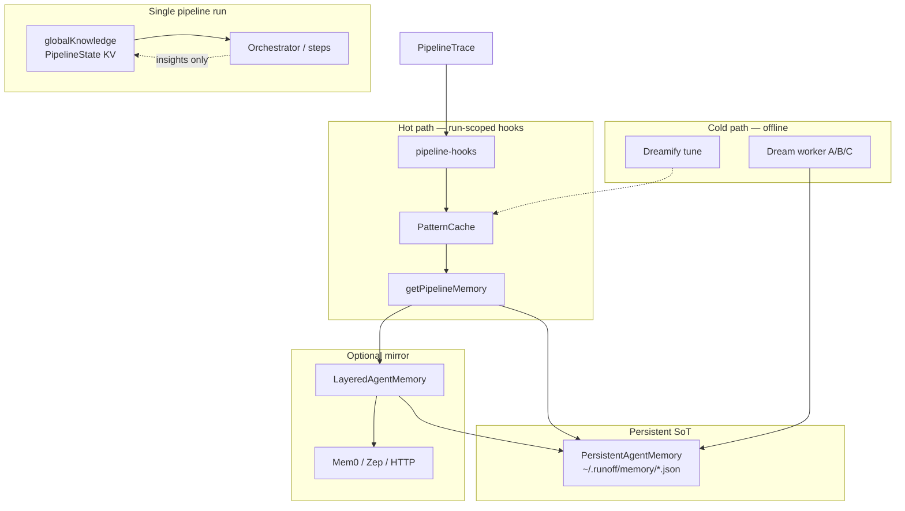

# Memory layers

> Last updated: 2026-05-31 · **Architecture governance** for pipeline memory

## Executive summary

Pipeline memory is **not one store** — it is layered by **lifetime**, **storage**, **read path**, and **Evolution timing**. Local disk under `~/.runoff/memory/` is the **source of truth (SoT)**. Remote backends (Mem0 / Zep / HTTP) are **write-through mirrors** with **async hybrid search** via MCP tools.

**Single runtime entry point (governed):** `getPipelineMemory()` in `src/memory/pipeline-memory.ts` — used by pipeline hooks **and** MCP memory tools.

---

## Layer map



---

## Layer 1 — Session blackboard (`globalKnowledge`)

| Attribute | Value |
|-----------|--------|
| **Scope** | One pipeline run (checkpoint-resumable) |
| **Type** | `Record<string, string>` on `PipelineState` |
| **Written by** | Orchestrator `onStepComplete` insights |
| **Read by** | `step-execution`, governance, step agents |
| **Cross-run** | No — unless resumed from same checkpoint |

**Purpose:** Run-internal shared context (orchestrator OODA), not long-term institutional memory.

**Code:** `src/core/state.ts`, `src/orchestration/pipeline-runner.ts`

**Governance note:** Insights here are **not** auto-promoted to `AgentMemory`. Promotion happens via PatternCache / Dream (by design — reduces noise in long-term store).

---

## Layer 2 — Agent memory (`AgentMemory`)

| Implementation | Use |
|----------------|-----|
| `InMemoryAgentMemory` | Unit tests only |
| `PersistentAgentMemory` | Production local SoT |
| `LayeredAgentMemory` | Local + optional remote client |

**Entry model:** `MemoryEntry` — `pattern`, `lesson`, `preference`, `trace_summary`, etc.

**Code:** `src/orchestration/memory.ts`, `src/orchestration/persistent-memory.ts`

---

## Layer 3 — Pattern cache (domain facade)

`PatternCache` sits on `AgentMemory` and implements OpenSpace-style **execution patterns**:

- **Formation (hot):** `storeFromTrace` on approved runs
- **Retrieval (hot):** `buildAssociativeContext(Async)` at `onPipelineStart`
- **Dreamify params:** `resolveDreamifyRetrieval()` affects semantic rank / limits

**Code:** `src/orchestration/pattern-cache.ts`, `src/pipeline/pipeline-hooks.ts`

---

## Layer 4 — Local vs remote read paths

| Path | API | When |
|------|-----|------|
| **Sync local** | `AgentMemory.retrieve()` | Pipeline hooks, PatternCache |
| **Async hybrid** | `LayeredAgentMemory.retrieveMerged()` | `runoff_query_memory`, optional async pattern match |
| **Write** | `store()` | Always local first; remote `push` best-effort async |

Configured via `orchestration.memoryBackend`. Hot-path hybrid read requires **`memoryHybridRetrieve: true`** (default **false**, G5). Timeout: `memoryHybridRetrieveTimeoutMs` (default 800ms).

**Important:** Hot path does **not** block on remote search. Remote-only entries may be invisible during a run unless hybrid async path succeeds within timeout.

**Docs:** [features/external-memory.md](../features/external-memory.md), [features/memory-production.md](../features/memory-production.md)

---

## Layer 5 — Cold path (Dream / Dreamify)

| System | F/E/R role | Trigger |
|--------|------------|---------|
| **Dream** | Evolution (ADD/UPDATE/CONTRADICT/FORGET) | `runoff_dream_run`, offline |
| **Dreamify** | Retrieval tuning | `runoff_dreamify_tune`, offline |

Does not block MCP pipeline. Artifacts: `dream-state.json`, `dream-audit.jsonl`, `dreamify/best-params.json`.

**Docs:** [features/memory-dream-roadmap.md](../features/memory-dream-roadmap.md), [features/dream.md](../features/dream.md)

---

## Runtime entry point (governance)

### Before (debt)

| Function | Behavior | Callers |
|----------|----------|---------|
| `getPipelineMemory()` | Singleton local + cached layered | `pipeline-hooks` |
| `createPipelineMemory()` | New instance each call | MCP `queryPipelineMemoryMerged` |

Two factories → inconsistent layered instances.

### After (2026-05-31, G2 + G6)

| Function | Role |
|----------|------|
| **`getPipelineMemory(config?, sessionId?)`** | **Canonical** singleton registry (hooks + MCP) |
| `resolveMemoryBackendConfig()` | Config only — stays in `memory-factory.ts` |

**Rule for new code:** import `getPipelineMemory` from `src/memory/pipeline-memory.ts`. Do not instantiate `PersistentAgentMemory` in feature code except tests.

---

## MCP tool mapping

| Tool | Memory layer touched |
|------|----------------------|
| `runoff_memory_status` | Backend config + probe (no mutation) |
| `runoff_query_memory` | `retrieveMerged` (local + remote) |
| `runoff_dream_run` | Cold Evolution → local SoT |
| `runoff_dreamify_tune` | Retrieval params (not store) |
| `runoff_dream_export` | Read-only export jsonl |
| `runoff_run_pipeline` | Hot Formation + pattern inject via hooks |

Host skill: [skill/SKILL.md](../../skill/SKILL.md)

---

## Boundaries

| System | Relationship |
|--------|--------------|
| **personal-vault / wiki KB** | Independent — no API coupling |
| **Trace files** | Input to Dream; not memory SoT |
| **`globalKnowledge`** | Run-scoped; persisted on trace at pipeline end; optional promotion to `lesson` via Dream B7 (`orchestration.dream.promoteGlobalKnowledge`) |

---

## Governance roadmap

| Phase | Item | Status |
|-------|------|--------|
| **G1** | Document layers (this file) | Done |
| **G2** | Unify factory → `getPipelineMemory` | Done |
| **G3** | Skill decision tree aligned to MCP tools | Done |
| **G4** | Promote high-value `globalKnowledge` keys to `lesson` via Dream rule B7 | Done |
| **G5** | Hot-path remote read explicit opt-in (`memoryHybridRetrieve: true`) | Done |
| **G6** | Remove deprecated `createPipelineMemory` alias | Done |

---

## Verification

```bash
npm run test:ci   # memory-factory, memory-backend-status, pipeline-hooks, dream*
# MCP smoke:
# runoff_memory_status — effective backend
# runoff_query_memory  — hybrid search
```

---

## Related

- [execution-layers.md](execution-layers.md) — TS / Python / IPC
- [trace-lifecycle.md](trace-lifecycle.md)
- [governance-config.md](governance-config.md)
