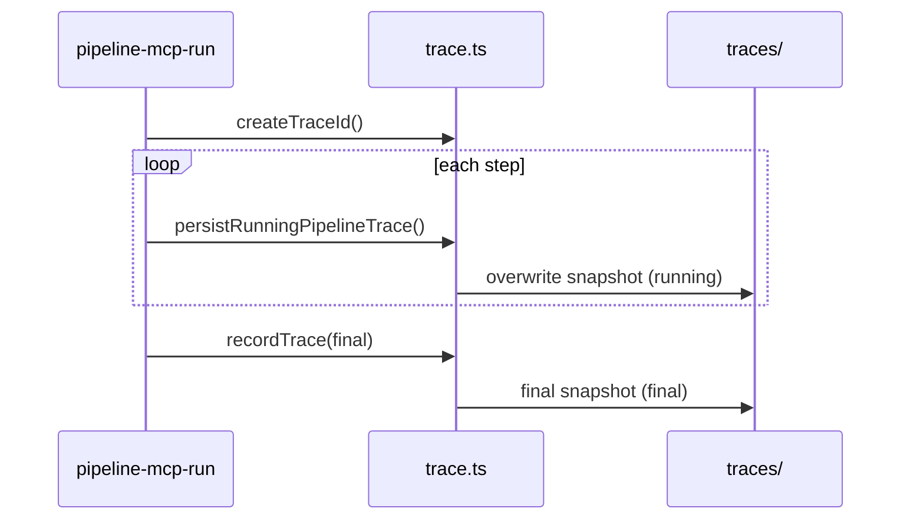

# Pipeline trace lifecycle (issue 6.10)

Traces live under `~/.runoff/traces/` as `YYYY-MM-DD_<traceId>.json` (atomic tmp + rename).

## States

| `lifecycle` | When | API |
|-------------|------|-----|
| `running` | After each step while the pipeline is in flight | `persistRunningPipelineTrace(trace)` |
| `final` | Success, failure, or abort at end of `runPipelineMcp` | `recordTrace({ ...trace, lifecycle: "final" })` |

`persistRunningPipelineTrace` is a thin wrapper: `recordTrace({ ...trace, lifecycle: "running" })`.

## Main-path flow

## Other APIs

- **`updateTrace(traceId, patch)`** — patch an on-disk trace in place (same filename suffix `_<id>.json`).
- **`loadTraceById` / `queryTraces` / `listTraces`** — read path for MCP `llm_query_traces` and analytics.
- **Hooks** — `PipelineHooks` may attach `costSummary`, OTel export, experiment metadata on end/fail.

## Race mode

Race sessions record candidate-level traces via `src/tools/race.ts`; final apply/abort still uses workspace + checkpoint rules documented in `execution-layers.md`.
