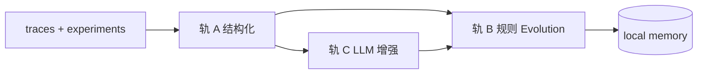

# Memory + Dream 路线图（Phase 9+）

> 对标参考：personal-vault `wiki/outputs/analyses/agent-memory-layer-landscape-2026.md`（F/E/R 三算子框架）。  
> **边界**：`runoff` = 执行侧记忆；`personal-vault` = 独立知识库，**不纳入本仓库集成范围**。

## 1. 目标

| 系统 | 职责 |
|------|------|
| **Memory（热/温路径）** | 跨 run 记住 pipeline 成功模式、lesson、实体关系；读写在 run 内或 run 后即时完成 |
| **Dream（冷路径）** | 离线补全 **Evolution**（整合 / 更新 / 遗忘），不阻塞 MCP pipeline |
| **Dreamify（冷路径）** | 用实验 eval 调检索超参（chunk/相似度/decay/limit），提升 Retrieval 质量 |

判断标准（操作性）：是否同时具备 **Formation、Evolution、Retrieval** 三算子；仅有「approved 就存 pattern」属于 Formation 偏重、Evolution 不足。

## 2. 与 personal-vault / Cognee 的边界

| 项目 | 关系 |
|------|------|
| **personal-vault** | 完全独立产品（wiki / 文献 / 概念 KG）。pipeline **不依赖** vault 读写。 |
| **Cognee（vault 内）** | **不在 M2 默认范围**。若未来需要，仅在 **M4** 评估是否提供 **可选、单向、文件级导出**（如 `lessons.jsonl`）供人工 ingest vault——**非实时双写、非 API 耦合**。 |

架构原则：**执行记忆留在 `~/.runoff/`**；机构/wiki 知识留在 vault。避免跨系统身份、Evolution 双源真相。

## 3. 当前基线（已实现）

- **Formation（热）**：`pattern-cache.storeFromTrace`、`trace-entities`、`feedbackRelevanceFromTrace`
- **Evolution（弱）**：`memory-decay`、`memory-merge` / `compact`、`memoryAutoCompact`
- **Retrieval**：本地 `semanticQuery` + pattern 联想；外置 Mem0/Zep **write-through + MCP `retrieveMerged`**（[`memory-production.md`](features/memory-production.md)）
- **可观测 / Eval**：[`observability.md`](features/observability.md) → Dreamify 目标函数

## 4. Dream v1 设计（已拍板：三轨并行）

Dream v1 **同时包含**下列三条管线，缺一不可：

### 4.1 轨 A — Trace 结构化（纯规则，无 LLM）

从 `traces/` + `experiments.jsonl` 增量读取，确定性提取：

- run 元数据：`experimentId`、`variant`、`finalStatus`、`costSummary`
- 步骤级：`provider`、`model`、`filesModified`、`verdict`、`errorDetail`
- 已有模块复用：`entryFromTrace`、`storeEntityTriples` 的字段契约

**输出**：结构化 `DreamBatchItem`（JSON），作为轨 B/C 的输入；**可审计、可单测**。

### 4.2 轨 B — 规则 Evolution（无 LLM）

在轨 A 之上应用确定性策略：

| 操作 | 规则示例 |
|------|----------|
| **ADD** | `approved` + 新 `promptHash` → pattern store |
| **UPDATE** | 同 hash 更高 `relevance` / 更少 token → patch metadata |
| **CONTRADICT** | 同 scope 下 lesson 与 pattern 冲突 → 降权或 `metadata.invalidated` |
| **FORGET** | decay 低于阈值 / TTL 过期 / compact 合并后删除冗余 |
| **反馈** | `feedbackRelevanceFromTrace` 批量重放 |

**输出**：对 `PersistentAgentMemory` 的原地变更 + `dream-audit.jsonl`（每条含 `ruleId`、`evidenceTraceId`）。

### 4.3 轨 C — LLM 增强（可选配置，默认开启）

在轨 A 结构化摘要之上，**小批量**调用 LLM（与 pipeline 共用 provider 配置或专用 `dream` step）：

- 从失败/部分成功 trace 提取 **lesson**（category `lesson`）
- 对高价值 approved run 生成 **trace_summary**（压缩多步为一段）
- 对轨 B 无法裁决的冲突做 **四路 judge**（ADD / UPDATE / CONTRADICT / IGNORE）— Mem0 式，但 **落盘仍以 local 为准**

**约束**：

- 异步、可 `orchestration.dream.enabled: false` 关闭 LLM 轨（仅 A+B 仍可跑）
- 单次 batch token 上限；失败不阻塞下次 Dream
- 所有 LLM 输出必须带 `evidenceTraceId`，禁止无溯源写入



## 5. Dreamify（检索调参，独立于 Dream）

- **输入**：`buildExperimentEvalReport` / dataset rows（TOP1 可观测）
- **搜索空间**：`minSemanticSimilarity`、`pattern limit`、decay λ、associative link 阈值
- **输出**：`~/.runoff/dreamify/best-params.json`（版本化，可回滚）
- **不在 run 热路径做在线搜索**

## 6. 分阶段交付

### M1 — 收口外置记忆热路径（TOP2 续）`DONE`

- `onPipelineStart` async + `buildAssociativeContextAsync`（`retrieveMerged`，超时回退 local）
- `getPipelineMemory(config, sessionId)` — 本地单例 + Zep 按 session 分层
- `orchestration.memoryHybridRetrieve` / `memoryHybridRetrieveTimeoutMs`
- `dream-state.json`（`lastDreamAt`）— `src/dream-state.ts`

### M2 — Dream v1（三轨）`DONE`

| 交付物 | 说明 |
|--------|------|
| `src/dream/dream-worker.ts` | 编排 A → B →（可选）C |
| `src/dream/dream-structured.ts` | 轨 A |
| `src/dream/dream-rules.ts` | 轨 B + `dream-audit.jsonl` |
| `src/dream/dream-llm.ts` | 轨 C |
| `runoff_dream_run` MCP | `src/tools/dream-run.ts` |
| [`docs/features/dream.md`](features/dream.md) | 运维与配置 |

**不含**：vault / Cognee API。

### M3 — Dreamify + 实验闭环 `DONE`

- 网格搜索（54 组合默认）+ `best-params.json` / history 回滚
- 评分：`buildExperimentEvalReport` + trace 检索命中率
- 热路径：`resolveDreamifyRetrieval()` → `PatternCache` / semantic rank
- MCP：`runoff_dreamify_tune` · [`docs/features/dreamify.md`](features/dreamify.md)

### M4 — 可选增强 `DONE`

- 多策略检索：`dreamify-multi-retrieve.ts`（`orchestration.dreamify.multiStrategy`）
- 双时间戳实体边：`validAt` / `recordedAt` / `invalidatedAt` on entity triples
- `dream-export.jsonl` + `runoff_dream_export` + `exportOnDreamRun`
- `runoff_show_config` → `dreamify` 状态块

## 7. 配置草案（`orchestration.dream`）

```json
{
  "orchestration": {
    "dream": {
      "enabled": true,
      "llmEnabled": true,
      "batchLimit": 50,
      "sinceLastRun": true,
      "project": "default"
    }
  }
}
```

## 8. 验证标准

| 阶段 | 通过条件 |
|------|----------|
| M2 轨 A | 固定 trace fixture → 结构化 JSON 快照一致 |
| M2 轨 B | 冲突/衰减 case → audit 条数 + memory 状态可断言 |
| M2 轨 C | mock LLM → lesson 写入且含 `evidenceTraceId` |
| M3 | 同一 `experimentId` eval 分数不低于调参前（或 token 降且分数不降） |

## 9. 相关文档

- [`memory-production.md`](features/memory-production.md) — 外置 Mem0/Zep
- [`external-memory.md`](features/external-memory.md) — HTTP 契约
- [`observability-eval.md`](features/observability-eval.md) — Dreamify 输入
- [`pipeline-hooks-runtime.md`](architecture/pipeline-hooks-runtime.md) — 热路径钩子
