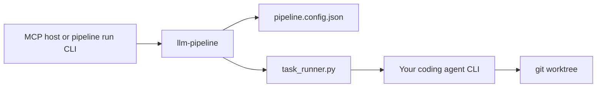

# Coding agent backends (CLI providers)

llm-pipeline **does not replace** Claude Code, Codex, Gemini CLI, or OpenCode. It **orchestrates** them as pipeline steps via the **`cli` provider type**.

Same pipeline (`implement` → `review` → retry). Swap `providers` to swap the underlying agent.

## How it works



1. TypeScript writes `*.task.json` (prompt, `workDir`, `delegateArgv`).
2. Python `task_runner.py` runs your CLI in an isolated worktree when `mode: agent-write`.
3. Results return as patch / `filesModified` → next pipeline step.

Config fields (`src/config.ts`):

| Field | Meaning |
|-------|---------|
| `type` | `"cli"` |
| `command` | Binary name or path (e.g. `codex`, `gemini`) |
| `args` | Prefix argv passed as `delegateArgv` (see `src/providers/cli.ts`) |
| `mode` | `"agent-write"` (edit repo) or `"agent-read"` / `"text"` |
| `timeoutMs` | Per-step timeout (large CLIs: 300000+) |

Template config: [`examples/configs/cli.config.json`](../examples/configs/cli.config.json).

---

## Quick setup (any backend)

1. Copy template into **your target repo** (not only llm-pipeline repo):

   ```bash
   cp /path/to/llm-pipeline/examples/configs/cli.config.json ./pipeline.config.json
   ```

2. Edit `providers` — enable one implement + one review backend.

3. Run:

   ```bash
   # MCP: point host cwd at repo with pipeline.config.json, then llm_run_pipeline

   # Or CLI (no IDE):
   cd /path/to/your/repo
   npx tsx /path/to/llm-pipeline/scripts/ts/dev/pipeline-cli.ts run \
     --prompt "Add hello() with tests" \
     --work-dir .
   ```

Requires **git** init in `workDir` for `agent-write`.

---

## Backend recipes

Adjust commands to your installed CLI version. Verify with `which <binary>`.

### OpenAI Codex CLI

```json
"codex": {
  "type": "cli",
  "command": "codex",
  "args": ["exec", "--full-auto", "--skip-git-repo-check"],
  "mode": "agent-write",
  "timeoutMs": 300000
}
```

Env: follow Codex CLI login/docs. For CI smoke see [`real-provider-smoke.md`](operations/real-provider-smoke.md) (`LLM_PIPELINE_REAL_CODEX_ARGV_JSON`).

### Google Gemini CLI

```json
"gemini": {
  "type": "cli",
  "command": "gemini",
  "args": [],
  "mode": "agent-write",
  "timeoutMs": 300000
}
```

Env: typically `GEMINI_API_KEY` if your CLI requires it.

### Claude Code (CLI)

Use the **`claude`** binary your installation provides (non-interactive flags vary by version):

```json
"claude-code": {
  "type": "cli",
  "command": "claude",
  "args": [],
  "mode": "agent-write",
  "timeoutMs": 300000
}
```

**MCP path:** Claude Code / Claude Desktop can also host llm-pipeline as an MCP server (`npm run dev`, `cwd` = target repo) — then the **host** calls `llm_run_pipeline`, and pipeline steps still use `cli` providers above for implement/review agents.

### OpenCode

[OpenCode](https://github.com/opencode-ai/opencode) (or your locally installed `opencode` binary):

```json
"opencode": {
  "type": "cli",
  "command": "opencode",
  "args": [],
  "mode": "agent-write",
  "timeoutMs": 300000
}
```

Set argv per your OpenCode non-interactive invocation docs when available.

### OpenAI API (no CLI)

For text-only steps without worktree:

```json
"openai": {
  "type": "openai",
  "model": "gpt-4o"
}
```

Requires `OPENAI_API_KEY`.

---

## Example pipeline (Codex implement + mock review)

See [`examples/configs/cli.config.json`](../examples/configs/cli.config.json). Minimal flow:

```json
{
  "providers": {
    "codex": { "type": "cli", "command": "codex", "args": ["exec", "--full-auto", "--skip-git-repo-check"], "mode": "agent-write", "timeoutMs": 300000 },
    "reviewer": { "type": "mock" }
  },
  "pipeline": {
    "implement": ["codex"],
    "review": ["reviewer", "implement"]
  },
  "retry": { "maxRounds": 3, "reviewStep": "review" }
}
```

Swap `"codex"` for `"gemini"` / `"claude-code"` / `"opencode"` in both `providers` and `pipeline` arrays.

---

## MCP hosts (not only Cursor)

| Host | Role |
|------|------|
| **Cursor** | MCP client → `llm_run_pipeline` |
| **Claude Desktop / Claude Code** | Same MCP registration pattern |
| **Any MCP-capable client** | `command` + `args` → `tsx …/src/index.ts`, `cwd` = target repo |

Example MCP snippet:

```json
{
  "mcpServers": {
    "llm-pipeline": {
      "command": "npx",
      "args": ["tsx", "/absolute/path/to/llm-pipeline/src/index.ts"],
      "cwd": "/absolute/path/to/your/repo-with-pipeline.config.json"
    }
  }
}
```

---

## Troubleshooting

| Symptom | Check |
|---------|--------|
| No worktree / lock errors | `git init` in `--work-dir`; clean `git status` |
| CLI times out | Raise `timeoutMs`; test CLI alone in repo |
| Empty experiment id | Use MCP/CLI path with `executePipelineRun` (hooks), not raw `runPipelineExecution` alone |
| Codex auth failures | Login per Codex docs; avoid CI without credentials |

---

## See also

- [`differentiation.md`](reference/differentiation.md) — vs LangGraph, CrewAI, AutoGen, OpenHands
- [`real-provider-smoke.md`](operations/real-provider-smoke.md) — opt-in live CLI verification
- [`execution-layers.md`](architecture/execution-layers.md) — TS vs Python boundaries
