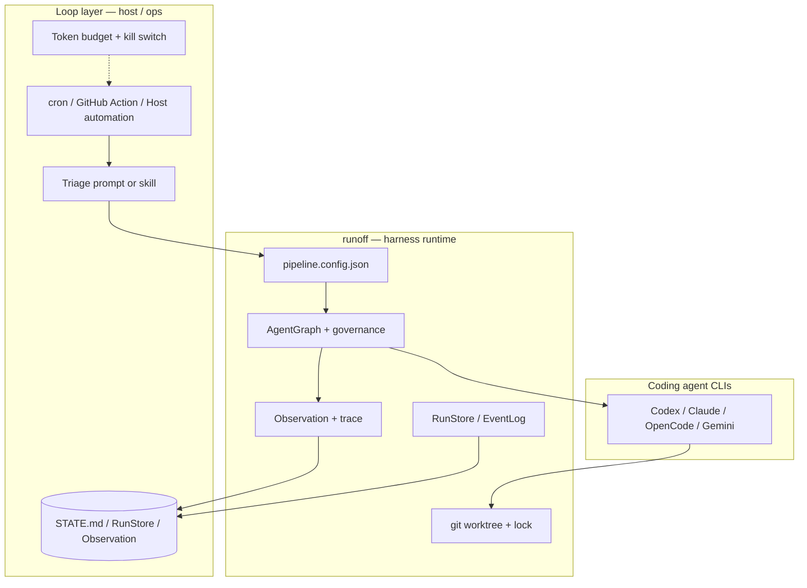

# Harness vs Loop

> How [loop-engineering](https://github.com/cobusgreyling/loop-engineering) vocabulary maps to runoff — and how to compose both without duplicating responsibility.

## One-line distinction

| Term | Job | runoff artifact |
|------|-----|-----------------|
| **Harness** | Environment for **one bounded run**: tools, isolation, governance, trace, resume | MCP server + `pipeline.config.json` + worktree IPC |
| **Loop** | System that **schedules and re-invokes** harness runs over time with durable state | Host cron / GitHub Action + `runoff_run_pipeline` + RunStore / Observation |

```
Loop     = schedule + triage + state + verification chain + human gates
Harness  = single pipeline execution inside that chain
```

This matches loop-engineering's [concepts.md](https://github.com/cobusgreyling/loop-engineering/blob/main/docs/concepts.md) and Addy Osmani's **Agent Harness Engineering** framing: you design the loop; runoff is the harness runtime the loop calls.

## Architecture map



**runoff does not replace the scheduler.** It exposes MCP tools so any loop host (Cursor, Claude Code, custom cron) can call `runoff_run_pipeline`, read `PipelineResult.observation`, and resume from checkpoint / approval tokens.

## Primitive mapping

Cross-reference: [loop-engineering primitives matrix](https://github.com/cobusgreyling/loop-engineering/blob/main/docs/primitives-matrix.md).

| loop-engineering primitive | runoff implementation | Notes |
|----------------------------|----------------------|-------|
| Automations / scheduling | **Host-side** | Use cron, GitHub Actions, or host `/loop` — not built into runoff |
| Worktrees | `workspace_manager.py` | Cross-process lock; TS delegates via `src/runtime/workspace.ts` |
| Skills | `AGENTS.md` / `CLAUDE.md` + harness evolution skill registry | Not agentskills.io yet; host skills trigger MCP calls |
| Plugins & connectors (MCP) | runoff **is** an MCP server | Host connects outbound; pipeline steps call CLI providers |
| Sub-agents (maker / checker) | DAG steps + `harness-role.ts` | `implement` → `review`; planner / generator / evaluator input isolation |
| Memory / state | Observation, RunStore, `completion-contract`, checkpoint | Machine-readable; optional human `STATE.md` overlay |

## Readiness levels (L1 → L3)

Borrowed from [loop-design-checklist](https://github.com/cobusgreyling/loop-engineering/blob/main/docs/loop-design-checklist.md), adapted for config-driven harnesses.

| Level | Description | runoff minimum |
|-------|-------------|----------------|
| **L0 — Draft** | Intent documented only | `pipeline.config.json` exists |
| **L1 — Report** | Triage → state, no auto-fix | `implement` + `review`, `controlPlane: "file"`, mock or read-only triage |
| **L2 — Assisted** | Small auto-fixes with verifier | Separate fixer vs reviewer providers; `runtime.governance.enabled`; `approvalMode: "defer"` |
| **L3 — Unattended** | Runs without constant watching | Governance denylist rules, `costBudgetUSD`, `maxStepExecutionsPerStep`, human gate only on risky paths |

Measure with:

```bash
npm run pipeline:init -- --work-dir /path/to/repo --profile pr-babysitter
npm run pipeline:doctor -- --config /path/to/repo/pipeline.config.json
```

Profiles: `pr-babysitter` | `race-pr-babysitter` | `ci-sweeper` | `daily-triage` (scaffolds `AGENTS.md` + `STATE.md`). Hosting guide: [host-loop-cookbook.md](host-loop-cookbook.md).

Loop Ready badge: `npm run runoff:doctor -- --config pipeline.config.json --badge`

### Phased rollout recipe

1. **Week 1 (L1):** Host runs pipeline on schedule; spec = "triage only — update STATE, no repo writes." Use mock providers or read-only CLI.
2. **Week 2 (L2):** Enable `fix` step with worktree isolation; governance `defer`; human merges via `runoff_race_apply` or git.
3. **Week 3+ (L3):** Add `costBudgetUSD`, path-based `require-approval` rules, and `maxStepExecutionsPerStep` caps.

## Pattern: PR Babysitter

loop-engineering's [PR Babysitter](https://github.com/cobusgreyling/loop-engineering/blob/main/patterns/pr-babysitter.md) watches open PRs, triages CI/review feedback, proposes minimal fixes, and escalates to humans.

runoff template: [`examples/configs/pr-babysitter.config.json`](../../examples/configs/pr-babysitter.config.json)

**Race variant (runoff moat):** [`race-pr-babysitter.config.json`](../../examples/configs/race-pr-babysitter.config.json) — `fix` step runs `fixer-a` vs `fixer-b`; pause at `awaiting_judge`; human calls `runoff_race_apply`.

| loop-engineering step | runoff step | Role (`harness-role.ts`) |
|-----------------------|-------------|--------------------------|
| PR + CI triage | `triage` | planner |
| `minimal-fix` | `fix` | generator |
| verifier (tests/lint) | `verify` | evaluator |
| review gate | `review` | evaluator |

**Host loop sketch (every 5–15 min):**

```text
1. Host gathers PR context (gh pr list, CI status) → passes as pipeline spec / context
2. runoff_run_pipeline(workDir=repo, config=pr-babysitter.config.json)
3. Read PipelineResult.observation.nextHint
4. If status=awaiting_approval → human reviews worktree diff
5. Append outcome to STATE.md or rely on RunStore event cursor
```

Token budget guidance from loop-engineering: target **no-op exits** when watchlist is empty; cap with `runtime.costBudgetUSD`.

## open-ptc-agent complement (not replacement)

[open-ptc-agent](https://github.com/Chen-zexi/open-ptc-agent) implements **Programmatic Tool Calling**: the model writes Python in a sandbox, calls MCP tools locally, and returns only aggregates to context.

| Concern | open-ptc-agent | runoff |
|---------|----------------|--------|
| Primary artifact | Sandbox files + summaries | Git worktree patches |
| Tool orchestration | Code in Daytona sandbox | Config DAG + CLI agents |
| Token efficiency | Process data in sandbox | Observation refs + bounded context (`context-contract.ts`) |

Use PTC-style thinking inside runoff loops for **data-heavy triage** (large CI logs, many PR comments): pre-aggregate in the host or a future sandbox step; pass summaries into the pipeline spec — do not inline raw JSON into prompts.

## MFS complement (optional context plane)

[MFS](https://github.com/zilliztech/mfs) (**M**ulti-source **F**ile-like **S**earch) unifies repo, docs, chat, tickets, and DB rows under stable URIs with `search` + `cat`. It answers **where context lives**; runoff answers **how to deliver and audit code changes**.

| Concern | MFS | runoff |
|---------|-----|--------|
| Cross-source retrieval | Connector + Milvus index | Host gather or pipeline spec |
| Evidence | `mfs cat` exact bytes | Observation + artifacts + trace |
| Code delivery | Out of scope | worktree + race + governance |

Host-side integration (no runoff dependency): [mfs-context-layer.md](mfs-context-layer.md).

## Loop readiness checks (doctor)

`npm run pipeline:doctor` runs environment checks **plus** loop-readiness when `--config` is set.

| Check | PASS criteria | Level impact |
|-------|---------------|--------------|
| `loop-review-step` | `retry.reviewStep` exists in `pipeline` | L1+ |
| `loop-maker-checker` | Review step depends on a prior implement/fix step | L1+ |
| `loop-separate-reviewer` | Review provider ≠ sole implement provider | L2+ |
| `loop-control-plane` | `runtime.controlPlane === "file"` | L1+ |
| `loop-retry-bounds` | `retry.maxRounds` defined (1–10) | L1+ |
| `loop-governance` | `runtime.governance.enabled === true` | L2+ |
| `loop-governance-rules` | At least one `require-approval` or `deny` rule | L3 |
| `loop-budget` | `runtime.costBudgetUSD` set | L3 |
| `loop-project-docs` | `AGENTS.md` or `CLAUDE.md` in config directory | L2+ |
| `loop-step-cap` | `maxStepExecutionsPerStep` set when governance on | L3 |
| `loop-sync-config` | `.runoff/loop-manifest.json` matches config fingerprint | loop profiles |
| `loop-sync-agents-level` | `AGENTS.md` level matches config complexity | L1+ loops |
| `loop-sync-state` | `STATE.md` has recent Last run | multi-tick loops |

Scoring weights are implemented in `src/pipeline/pipeline-doctor.ts` (`evaluateLoopReadiness`).

### Token budget estimate

```bash
npm run pipeline:cost -- --config /path/to/repo/pipeline.config.json --pattern pr-babysitter --cadence 10m --level L2
```

Uses trace history when available (`costSummary`); otherwise pattern defaults from loop-engineering cost profiles.

### Suggestions the doctor emits

Examples (non-exhaustive):

- Enable `runtime.controlPlane: "file"` for durable loop state.
- Add a `review` step and set `retry.reviewStep`.
- Use different providers for implement vs review (maker/checker).
- Enable `runtime.governance` before unattended fixes.
- Add path-based `require-approval` rules for auth/payments/secrets.
- Set `runtime.costBudgetUSD` before high-cadence loops.

## What runoff should not become

- A cron scheduler (keep scheduling in the host).
- A `STATE.md`-first SoT (config + RunStore remain authoritative).
- A PTC sandbox runtime (worktree isolation stays the delivery path).
- A full MFS-style knowledge platform (optional host-side MFS only — see [mfs-context-layer.md](mfs-context-layer.md)).

## Related docs

- [differentiation.md](../reference/differentiation.md) — runoff vs other orchestrators
- [governance-config.md](../architecture/governance-config.md) — L2/L3 guardrails
- [observability.md](../features/observability.md) — Observation as loop work memory
- [prince-context-harness-lessons.md](../design/prince-context-harness-lessons.md) — context / harness contracts
- [examples/README.md](../../examples/README.md) — config templates including PR Babysitter
- [host-loop-cookbook.md](host-loop-cookbook.md) — MCP / Actions / cron loop hosting
- [mfs-context-layer.md](mfs-context-layer.md) — optional MFS + runoff integration

## External references

- [loop-engineering](https://github.com/cobusgreyling/loop-engineering) — patterns, `loop-init`, `loop-audit`, `loop-cost`
- [MFS](https://github.com/zilliztech/mfs) — multi-source context plane (`mfs-ingest` / `mfs-find`)
- [open-ptc-agent](https://github.com/Chen-zexi/open-ptc-agent) — programmatic MCP via sandbox code
- [Anthropic — Code execution with MCP](https://www.anthropic.com/engineering/code-execution-with-mcp)
