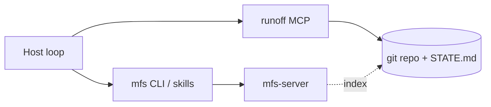

# MFS as optional loop context layer

> How [MFS (Multi-source File-like Search)](https://github.com/zilliztech/mfs) complements runoff — **read context here, deliver code there**.
> Host loop entry: [host-loop-cookbook.md](host-loop-cookbook.md).

runoff does **not** bundle or require MFS. This doc describes an optional integration pattern for teams that already run (or plan to run) `mfs-server` beside their MCP host.

## Division of labor

| Layer | Tool | Question it answers |
|-------|------|---------------------|
| **Context plane** | [MFS](https://github.com/zilliztech/mfs) | Where is the relevant context across repo, CI, Slack, Jira, docs, DB…? |
| **Delivery harness** | runoff | How do we run triage → fix → verify → review with worktree isolation, governance, trace, and race? |
| **Loop scheduler** | Host (Cursor, Claude Code, Actions) | When do we tick, and what goes in `STATE.md`? |

```
Host loop tick
  → MFS: search (candidates) → cat (evidence)
  → runoff_run_pipeline: bounded DAG + Observation
  → Host: read loopAction / update STATE.md
```

MFS implements **search → browse** (candidates, then exact bytes). runoff implements **maker/checker delivery** (patches under review). Do not ask MFS to apply git changes; do not ask runoff to index Slack across the company without a host-side gather step.

## When to use MFS in a runoff loop

| Situation | MFS helps | Skip MFS |
|-----------|-----------|----------|
| PR babysitter — PR comments + CI logs + repo | Cross-source semantic search | Single-repo, `gh` + small log is enough (L1) |
| CI sweeper — large failure logs | `search` locates failing step; `cat --range` pulls lines | Log fits in one paste |
| Daily triage — issues + chat + docs | `mfs search … --all` | Week-1 report-only with `STATE.md` only |
| Fix step needs prior decision memory | Index session memory / skills URIs | runoff `memory/` + trace already cover pipeline patterns |

**Default:** L1 loops need no MFS. Add MFS when manual context gathering becomes the bottleneck.

## One-time setup (host / agent machine)

Install MFS skills (agent-driven setup also works):

```bash
npx skills add zilliztech/mfs --all -g
# or: npx skills add zilliztech/mfs -a claude-code -a cursor -g
```

Shell-only path (no agent skills):

```bash
uv tool install mfs-server && mfs-server run   # background server
# CLI: cargo install mfs-cli, or release installer — see MFS README
```

First run downloads a local embedding model (~600 MB) into `~/.mfs/` unless you configure a remote embedding API. Credentials for connectors (Slack, Jira, …) resolve on the **server**, not in runoff.

## Register sources for a loop (mfs-ingest)

Register once per machine/server; re-run `mfs add` to re-sync.

```bash
# Code under loop
mfs add /path/to/your-repo

# Loop memory (alongside runoff STATE.md)
mfs add /path/to/your-repo/STATE.md
mfs add /path/to/your-repo/AGENTS.md

# Optional connectors (TOML + credentials on server — see MFS docs)
# mfs add slack://acme --config ./slack.toml
# mfs add github://org/repo --config ./github.toml
```

For PR/CI loops, typical connectors: local repo (`file://`), GitHub repo/issues, CI artifact directory, Slack channel JSONL export.

## Loop tick: MFS → runoff prompt contract

**Rule:** Pass **summaries + stable URI refs** into `runoff_run_pipeline`. Never inline raw `mfs search` hit lists or full logs — aligns with runoff `context-contract` forbidden inputs (`raw_provider_payloads`, `inline_tool_json`, `unbounded_repo_context`).

### Step-by-step

```text
1. Host reads STATE.md (priorities, watchlist).
2. If watchlist empty → skip runoff (early exit); optional no-op mfs skipped.
3. mfs search "<task-specific query>" [--all | scoped URI]
4. For top 1–3 hits: mfs cat <uri> [--range a:b | --locator '{...}']
5. Build pipeline prompt:
   - ## Loop tick goal (one paragraph)
   - ## Watchlist (from STATE.md)
   - ## Evidence (short excerpts + URI per excerpt)
   - ## Non-goals (from AGENTS.md)
6. runoff_run_pipeline(workDir, prompt, configPath)
7. Read observation.loopAction / status / nextHint → update STATE.md
```

### Prompt template (copy-ready)

```markdown
## Loop tick — PR Babysitter

### Watchlist
<paste High Priority section from STATE.md>

### Evidence (verified via mfs cat — do not invent beyond this)
- file://local/.../src/foo.ts (lines 42–78): <2–5 line excerpt>
- slack://acme/.../messages.jsonl: <1–2 relevant lines>
- jira://acme/... PLAT-491: <summary>

### Task
Triage only if no actionable item; otherwise run fix → verify → review per pipeline.config.json.
If evidence is insufficient, report coverage gaps and stop — do not guess.
```

### Anti-patterns

| Do not | Do instead |
|--------|------------|
| Paste entire `mfs search` JSON/output into prompt | 3–5 line excerpts + URI |
| Paste 500 KB CI log | `mfs search` + `mfs cat --range` on failing file |
| Let implement step call MFS directly without host gate | Host gathers context; pipeline spec is bounded |
| Treat search score as ground truth | Re-open with `mfs cat` before citing in review |

## Pattern recipes

### PR Babysitter (+ optional race)

```bash
mfs search "open PR review comments and failing checks" /path/to/repo --all
mfs cat file://local/.../pull-123.diff --range 1:120   # example
```

Host prompt notes `race-pr-babysitter` profile: on `awaiting_judge`, human runs `runoff_race_apply` — MFS does not pick race winners.

### CI Sweeper

```bash
mfs search "test failure stack trace" file://local/path/to/ci-artifacts
mfs cat file://local/.../test-output.log --range 8800:8950
```

Keep fix scope minimal; governance denylist on `.github/workflows` stays in `pipeline.config.json`.

### Daily Triage (L1)

```bash
mfs search "what changed in last 24h needing attention" --all
```

Week 1: **report only** — update `STATE.md`, do not enable fix steps. MFS reduces missed signals; runoff stays on `daily-triage` profile.

## How this maps to runoff internals

| MFS concept | runoff counterpart |
|-------------|-------------------|
| `search` hits | Host-composed `prompt` / spec (not stored in runoff index) |
| `cat` bytes | Should appear as short excerpts; full content → artifacts after implement |
| URI (`file://`, `slack://`) | Future-friendly evidence addrs; today paste into prompt + trace promptVersion |
| Connector credentials on server | Same boundary as runoff: TS never holds Slack/Jira secrets for connectors |
| Derived Milvus index | Unlike runoff trace (audit) — rebuildable, not SoT |

runoff **memory** ([external-memory.md](../features/external-memory.md)): Mem0/Zep/http = session/pipeline memory. MFS = federated knowledge plane. They can coexist; do not configure both to answer the same question without documenting which wins.

## Architecture (optional deployment)



- **Local dev:** `mfs-server` on the same machine as the agent; runoff MCP stdio to Cursor.
- **CI:** Usually skip MFS unless you run a remote `mfs-server`; prefer event payload + small context for Actions ticks.
- **runoff does not call MFS** in P0/P1 — integration is host-orchestrated only; runoff records `contextRefs` in Observation for re-fetch.

## P1: runoff context contract (implemented)

| Mechanism | Behavior |
|-----------|----------|
| `analyze` / `triage` steps | `requiredEvidence` includes `contextRefs` when host supplied `context` |
| `composeBoundedStepContext` | Inline JSON search hit lists → bounded summary + extracted refs |
| `ContextCompositionReport.contextRefs` | URIs parsed from host context (`file://`, `mfs://`, paths) |
| `PipelineObservation.contextRefs` | Aggregated refs across steps; `evidence` includes `contextRef=…` strings |

Host template for triage context:

```text
## Triage context (refs only — no search dump)

Summary: CI failed on lint step; PR comment asks for retry logic.

Evidence excerpts:
- mfs://repo/src/foo.ts:42-58 — failing assertion
- file:///path/to/ci.log:1200-1250 — stderr tail

Refs for re-cat: mfs://repo/src/foo.ts, mfs://ci/artifact/run-123.log
```

runoff doctor does not require MFS; missing `contextRefs` on analyze steps with context input surfaces as Observation coverage gaps.

## P2: MCP bridge + harness context_route connector (implemented)

| Surface | Tool / action | Behavior |
|---------|---------------|----------|
| Host triage | `runoff_query_context` `mode=search` | Wraps `mfs search --json`; returns bounded hits + `contextRefs` + `promptBlock` |
| Evidence read | `runoff_query_context` `mode=cat` | Wraps `mfs cat --skim` or `-n range`; truncates excerpt |
| Harness route | `runoff_query_context` `mode=resolve_route` | Resolves `HarnessContextRoute` refs → bounded excerpts |
| Harness evolve | `runoff_harness_evolve` `action=context_route_resolve` | Same resolution, audit artifact oriented |
| Node kind | `HarnessContextNode.kind=mfs` | Topology nodes with `mfs://` refs participate in routing |

**Still optional:** runoff does not bundle `mfs-server`. When `mfs` is absent, tools return structured errors + `probe.available=false`; host manual gather remains valid.

Example:

```bash
# MCP host (conceptual)
runoff_query_context { "mode": "search", "query": "failing CI lint", "scope": ".", "topK": 3 }
runoff_query_context { "mode": "cat", "uri": "mfs://repo/src/foo.ts", "range": "40:80" }
runoff_query_context { "mode": "resolve_route", "routeId": "route-operating", "workDir": "/path/to/repo" }
```

Pass `promptBlock` from the tool into `runoff_run_pipeline` `context` — not the raw CLI stdout.

## Checklist before enabling in production loops

- [ ] MFS server reachable from the host agent (`mfs status`)
- [ ] Sources registered for repos + STATE.md (+ connectors as needed)
- [ ] Host prompt template enforces excerpt + URI (no search dump)
- [ ] `pipeline.config.json` governance enabled for L2+ (`approvalMode: defer`)
- [ ] `runoff:doctor` ≥ L2; `costBudgetUSD` set
- [ ] Week 1 triage-only validated before fix steps

## Related

- [host-loop-cookbook.md](host-loop-cookbook.md) — scheduling runoff loops
- [harness-vs-loop.md](harness-vs-loop.md) — harness vs loop vocabulary
- [observability.md](../features/observability.md) — Observation / `loopAction`
- [prince-context-harness-lessons.md](../design/prince-context-harness-lessons.md) — context contracts
- [MFS README](https://github.com/zilliztech/mfs) · [MFS architecture](https://github.com/zilliztech/mfs/blob/main/docs/architecture.md)
